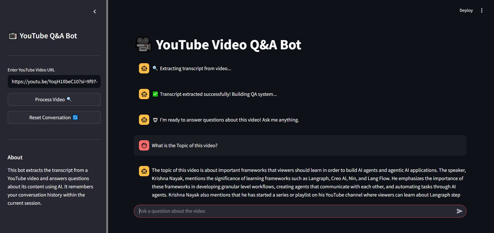

Here’s your updated **README.md** rewritten to reflect the new **YouTubeTranscriptAPI-based transcript extraction** while preserving the overall structure and style — with emojis, better formatting, and clear language:

---

# 🎥 YouTube Video Q\&A Bot 🤖

A **Streamlit** web app that extracts transcripts directly from YouTube videos using the **YouTubeTranscriptAPI** and answers your questions about the video using **OpenAI's GPT models** and **LangChain**.

---

## ✨ Features

* 📜 Extracts video transcripts directly from YouTube using the official transcript API
* 🤖 Builds a conversational AI assistant to answer questions based on video content
* 🔍 Uses OpenAI embeddings + vector search for fast and accurate retrieval
* 🧠 Remembers past queries for contextual follow-up questions
* ⏳ Shows progress bars and status messages during processing
* 💬 Clean, user-friendly chat interface powered by Streamlit

---

## 🎬 Dashboard


*(Add your demo GIF or screenshot here)*

---

## 🚀 Getting Started

### 🔧 Prerequisites

* Python 3.8+
* OpenAI API key ([Get one here](https://platform.openai.com/account/api-keys))
* Install dependencies via `pip`

### 🛠️ Installation

1. Clone the repository:

   ```bash
   git clone https://github.com/Akshay-K8/YoutubeVideo_QA.git
   cd YoutubeVideo_QA
   ```

2. Install required packages:

   ```bash
   pip install -r requirements.txt
   ```

3. Add your OpenAI key to a `.env` file:

   ```
   OPENAI_API_KEY=your_openai_api_key_here
   ```

4. Make sure `video_to_transcript()` in `app.py` uses `YouTubeTranscriptApi` to extract captions.

---

## ▶️ Usage

Run the app:

```bash
streamlit run app.py
```

Then:

* 🔗 Paste a YouTube video URL in the sidebar
* 🛠 Click **Process Video** to fetch the transcript and build the QA system
* ❓ Ask any question about the video content
* 🔄 Click **Reset Conversation** to start fresh

---

## 🧱 Code Structure

| File               | Purpose                                            |
| ------------------ | -------------------------------------------------- |
| `app.py`           | Main Streamlit app UI and logic                    |
| `.env`             | Stores OpenAI API key                              |
| `requirements.txt` | All dependencies                                   |

---

## ⚙️ Technologies Used

* [Streamlit](https://streamlit.io/) – For building the UI
* [OpenAI GPT-3.5-turbo](https://platform.openai.com/docs/models/gpt-3-5) – LLM for answering questions
* [LangChain](https://www.langchain.com/) – Framework for chaining LLM tasks
* [ChromaDB](https://www.trychroma.com/) – Vector DB for semantic search
* [YouTubeTranscriptApi](https://pypi.org/project/youtube-transcript-api/) – For pulling transcripts from videos

---

## ⚠️ Notes

* The YouTubeTranscriptApi only works if the video has captions enabled.
* Private, age-restricted, or live videos may not return transcripts.
* Using OpenAI APIs will incur usage costs based on model usage.
* This app is for educational/prototyping use — not production-grade.

---

## 🤝 Contributing

All contributions are welcome!
Open an issue or submit a PR if you have improvements, bug fixes, or ideas.

---

If you face any issues, feel free to reach out. Happy building! 🛠️😊

---

Let me know if you'd like to embed a **project logo**, add **badge shields**, or generate a **demo GIF**!
